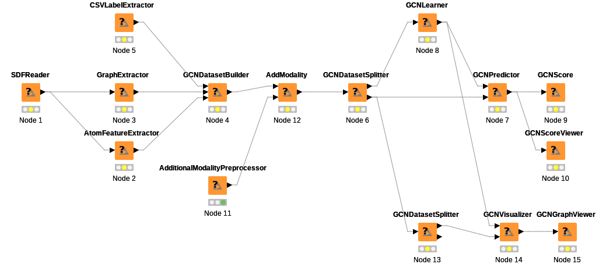

## マルチモーダルモデル（可視化）のテスト

上図のようにグラフ構造を作成する  
SDFReaderノードをダブルクリックして出るconfigure画面でSDFファイルに5HT1A_HUMAN.sdfを指定する  
CSVLaeblExtractorノードをダブルクリックして出るconfigure画面でCSVファイルにlabel.csvを指定する  
AdditionaModalityPreprocessorノードをダブルクリックして出るconfigure画面でCSVファイルにseq_profeat.csvを指定する  
train_sample.json, test_sample.json, visualize_sample.jsonを参考にGCNLearner, GCNPredictor, GCNVisualizerのオプションを指定する  
GCNScore, GCNScoreViewer, GCNGraphViewerを右クリック→execute  
multimodal以下に計算結果が出力される  

[ワークフローファイル](KNIME_project_multimodal.knwf)

