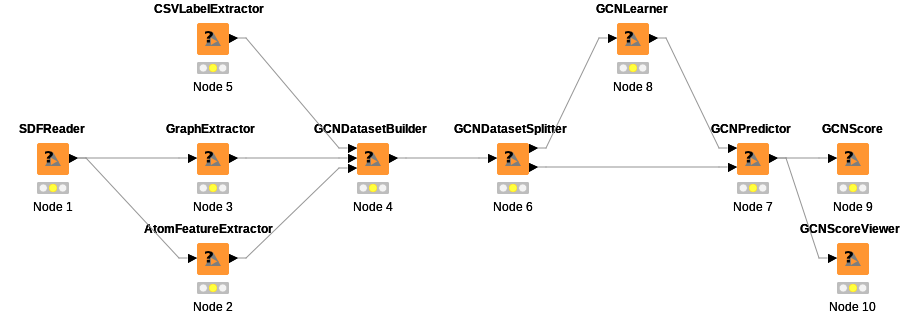

## マルチタスクモデルのテスト

上図のようにグラフ構造を作成する  
SDFReaderノードをダブルクリックして出るconfigure画面でSDFファイルにtox21.sdfを指定する  
CSVLaeblExtractorノードをダブルクリックして出るconfigure画面でCSVファイルにtox21.csvを指定する  
train_sample.json, test_sample.jsonを参考にGCNLearner, GCNPredictorのオプションを指定する  
GCNScore, GCNScoreViewerを右クリック→execute  
multitask以下に計算結果が出力される  

[ワークフローファイル](KNIME_project_multitask.knwf)

