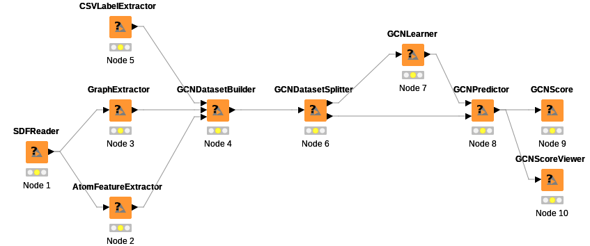

## シングルタスクモデルのテスト

上図のようにグラフ構造を作成する  
SDFReaderノードをダブルクリックして出るconfigure画面でSDFファイルにSDF_wash.sdfを指定する  
CSVLaeblExtractorノードをダブルクリックして出るconfigure画面でCSVファイルにlabels.csvを指定する  
train_sample.json, test_sample.jsonを参考にGCNLearner, GCNPredictorのオプションを指定する  
GCNScore, GCNScoreViewerを右クリック→execute  
singletask以下に計算結果が出力される  

[ワークフローファイル](/KNIME_project_singletask.knwf)

